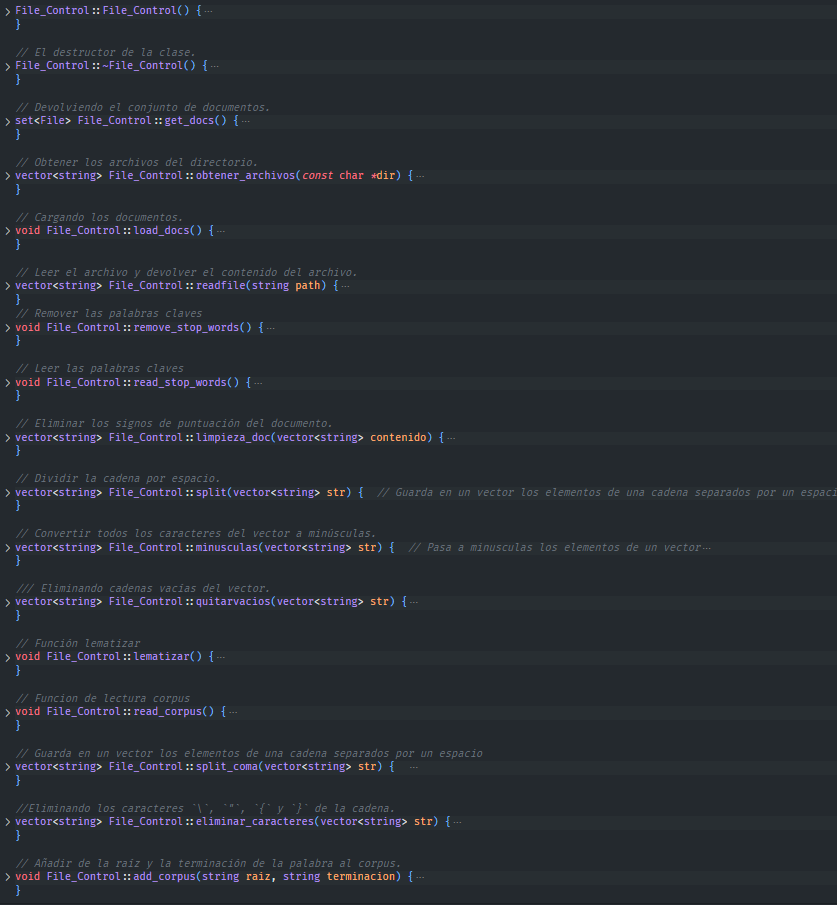
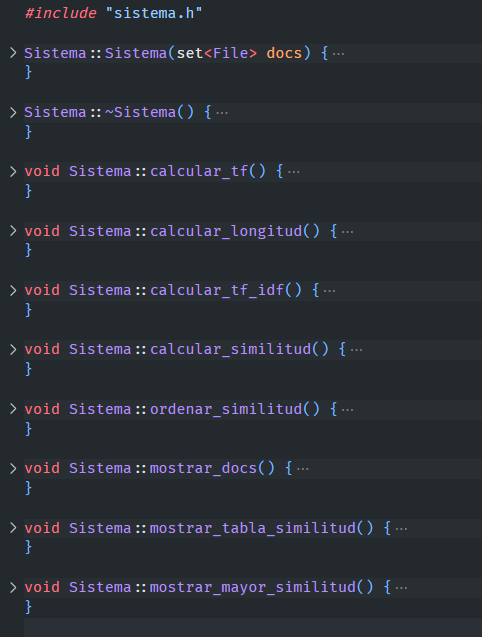

# Sistema de Recomendación. Modelos basados en el contenido

## Autores:
- Joseph Gabino Rodríguez
- Jonay Méndez Márquez
- Jairo Alonso Abreu
- José Javier Díaz González

## Descripción:

Este proyecto consiste en un sistema de recomendación basado en el contenido. Este sistema de recomendación utiliza algoritmos para identificar patrones en el contenido y así generar recomendaciones de forma automática. Este sistema de recomendación utiliza una variedad de técnicas para identificar patrones, como el **TF, el IDF o el TF-IDF**. Este sistema es útil ya que permite recomendaciones de manera automática y precisa.

## Ejecución
Para poder ejecutar el programa se ha de usar el comando **make**.
```bash
make
```
Luego, se ejecuta el comando **./main** y automáticamente se podrá ver todas las opciones seleccionadas
```bash
./main
```
En caso de querer visualizar mejor los resultados
```bash
./main >> file.txt
```

## Licencia 
#### **[MIT](https://choosealicense.com/licenses/mit/)**

---

## Descripción de uso

La interfaz consta de varios elementos:
  - 1) `Corpus files`: Idioma del fichero en cuestión.
  - 2) `Stop words files`: Idioma del fichero stop word.
  - 3) `Docs files`: Fichero .txt en cuestión.
  - 4) `Nombre`: Nombre del documento.
  - 5) `Ruta`: Ruta del directorio donde se encuentra el .txt.
  - 6) `Término`: Palabras que contienen dentro del fichero .txt.
  - 7) `Indice`: Indice que contienen dentro del fichero .txt.
  - 8) `TF`: (Term Frequency). Cantidad de veces que aparece una palabra.
  - 9) `IDF`: (Inverse Document Frequency). Reduce el peso de los términos que aparecen en los documentos.
  - 10) `TF-IDF`: (Term Frequency – Inverse Document Frequency). Codifica documentos en un espacio Euclídeo multi-dimensional.
  - 11) `Longitud`: Longitud del fichero .txt
  - 12) `Tabla de similitud`: Similaridad coseno entre cada par de documentos.

---

## Estructura del proyecto
> Descripción de las carpetas y ficheros que componen el proyecto

**Esquema de directorios**
  - `/corpus/`&ensp;➔&ensp;Baúl de corpus
    - **corpus-en.txt/**&ensp;➔&ensp;Donde se encuentra el idioma de corpus.
  - `/docs/`&ensp;➔&ensp;Baúl de docs
      - **documents-01.txt/**&ensp;➔&ensp;Donde se encuentra el fichero.txt para el documento
  - `/stop-words/`&ensp;➔&ensp;Baúl de stop words
      - **stop-words-en.txt/**&ensp;➔&ensp;Donde se encuentra el fichero.txt para el stop words
  - `file_control.cc`&ensp;➔&ensp;Fichero de control en .cc
  - `file_control.h`&ensp;➔&ensp;Fichero de control en .h
  - `file.cc`&ensp;➔&ensp; Fichero .cc
  - `file.h`&ensp;➔&ensp; Fichero .h
  - `main.cc`&ensp;➔&ensp;Archivo main del programa
  - `sistema.cc`&ensp;➔&ensp;Programa funcional con todas las características .cc
  - `sistema.h`&ensp;➔&ensp;Programa funcional con todas las características .h
  - `usage.cc`&ensp;➔&ensp; Fichero de ayuda .cc
  - `usage.h`&ensp;➔&ensp; Fichero de ayuda .h
  - `Makefile`&ensp;➔&ensp;Archivo Makefile
  - `README.md`&ensp;➔&ensp;Documentación del programa

---

## Backstage
> ¿Cómo funciona el programa?

- Como en cualquier programa, el desarrollo empieza resolviendo una serie de problemas planteados de inicio. En este caso, sabemos que el programa se ejecutará y se mostrará una serie de mensajes seguido de un sistema de recomendación basado en el contenido. 

En la carpeta `/docs/`, `/corpus/` y `/stop-words/` se pueden agregar todos los archivos que sean necesarios siempre y cuando sigan el formato de ejemplo, así sirve para comparar ejemplos.

## Desarrollo del programa

A continuación mostraremos todas las funciones importantes del programa.

### Función `remove_stop_words()`.

```c++
void File_Control::remove_stop_words() {
  read_stop_words();
  set<File> newdocs;
  for (File aux : docs_) {
    vector<string> aux_content = aux.get_content();
    for (int i = 0; i < aux_content.size(); i++) {
      for (string aux_stop : stop_words_) {
        if (aux_content[i] == aux_stop) {
          aux_content[i].clear();
        }
      }
    }
    aux_content = quitarvacios(aux_content);
    aux.set_content(aux_content);
    newdocs.insert(aux);
  }
  docs_ = newdocs;
}
```
- Tenemos una función para remover palabras claves, es decir, remueve las palabras contenidas en el conjunto stop_words_ de un conjunto de documentos almacenados en el conjunto docs_. La función lee primero las palabras de parada, luego itera sobre cada documento en docs_ y compara sus palabras con las palabras de parada. Si hay una coincidencia, la palabra se elimina y el contenido del documento se actualiza. Luego, el conjunto docs_ se actualiza con los documentos actualizados.

### Función `read_stop_words()`.

```c++
void File_Control::read_stop_words() {
  vector<string> contenido;
  for (int i = 0; i < stop_words_files_.size(); i++) {
    ifstream file(stop_words_dir_ + "/" + stop_words_files_[i]);
    string line;
    while (getline(file, line)) {
      contenido.push_back(line);
    }
  }
  contenido = split(contenido);
  contenido = minusculas(contenido);
  for (string aux : contenido) {
    stop_words_.insert(aux);
  }
}
```
- Lee los archivos de stop words de una carpeta y los carga en una variable de tipo "set" llamada stop_words_. El código inicia abriendo los archivos uno a uno y guardando todas las líneas en un vector llamado contenido. Luego, el vector contenido se divide en palabras individuales usando una función split() y las palabras se convierten a minúsculas usando una función minusculas(). Por último, se recorre el vector contenido y se agregan todas las palabras al set de stop_words_.

### Función `split()`.

```c++
vector<string> File_Control::split(vector<string> str) {  
  vector<string> lista;
  for (int i = 0; i < str.size(); i++) {
    string splitted;
    stringstream linea(str[i]);
    string aux;

    while (getline(linea, splitted, ' ')) {
      lista.push_back(splitted);
    }
    linea.clear();
    linea.str(lista[lista.size() - 1]);
    while (getline(linea, splitted, '\r')) {
      lista[lista.size() - 1] = splitted;
    }
  }
  return lista;
}
```

- La función recibe un vector de cadenas y devuelve un vector de cadenas, donde cada elemento del vector contiene una palabra de la cadena original, separada por un espacio. Esto se consigue al usar el método getline() para dividir cada elemento del vector original en varios elementos del vector de salida, separados por un espacio. Además, el último elemento del vector de salida se limpia de caracteres especiales como el retorno de carro ('\r').

### Función `minusculas()`.

```c++
vector<string> File_Control::minusculas(vector<string> str) {  /
  vector<string> lista;
  for (int i = 0; i < str.size(); i++) {
    string aux;
    for (int j = 0; j < str[i].size(); j++) {
      aux += tolower(str[i][j]);
    }
    lista.push_back(aux);
  }
  return lista;
}
```

- La función recibe un vector de strings como parámetro y devuelve otro vector de strings con los mismos elementos convertidos a minúsculas. Para ello recorre cada elemento del vector pasado como parámetro, recorre cada caracter de cada elemento y lo convierte a minúsculas usando la función tolower. Los elementos convertidos se añaden al nuevo vector que se devuelve como resultado.

### Función `read_corpus()`.

```c++
void File_Control::read_corpus() {
  vector<string> contenido;

  for (int i = 0; i < corpus_files_.size(); i++) {
    ifstream file(corpus_dir_ + "/" + corpus_files_[i]);
    string line;
    while (getline(file, line)) {
      contenido.push_back(line);
    }
  }
  contenido = split_coma(contenido);
  contenido = eliminar_caracteres(contenido);
  bool flag;
  string aux, aux2;
  for (int j = 0; j < contenido.size(); j++) {
    flag = false;
    aux.clear();
    aux2.clear();
    for (int k = 0; k < contenido[j].size(); k++) {
      if (contenido[j][k] == ':') {
        flag = true;
        k++;
      }
      if (!flag) {
        aux2.push_back(contenido[j][k]);
      } else {
        aux.push_back(contenido[j][k]);
      }
    }
    add_corpus(aux, aux2);
  }
}
```
Este código lee uno o más archivos de corpus (archivos de texto) y los almacena en un vector de cadenas de caracteres. Luego, el vector de cadenas se divide en partes separadas por comas, luego se eliminan ciertos caracteres específicos y, finalmente, se agregan los elementos al corpus.

### Función `lematizar()`.

```c++
void File_Control::lematizar() {
  read_corpus();
  set<File> newdocs;
  for (File aux : docs_) {
    vector<string> aux_content = aux.get_content();
    for (int i = 0; i < aux_content.size(); i++) {
      for (int j = 0; j < corpus_.size(); j++) {
        for (int k = 0; k < corpus_[j].second.size(); k++) {
          if (aux_content[i] == corpus_[j].second[k]) {
            aux_content[i] = corpus_[j].first;
          }
        }
      }
    }
    aux.set_content(aux_content);
    newdocs.insert(aux);
  }
  docs_ = newdocs;
}
```

- El código lematiza un conjunto de documentos. Primero, lee la función read_corpus y luego recorre cada documento. Para cada palabra del documento, comprueba si la palabra coincide con una palabra del corpus. Si es así, cambia la palabra en el documento por la palabra del corpus. Después, añade el documento lematizado a un conjunto de documentos. Finalmente, reemplaza el conjunto de documentos con el conjunto de documentos lematizados.

### Función `add_corpus()`.

```c++
void File_Control::add_corpus(string raiz, string terminacion) {
  bool encontrado = false;
  for (int i = 0; i < corpus_.size(); i++) {
    if (corpus_[i].first == raiz) {
      encontrado = true;
      corpus_[i].second.push_back(terminacion);
      return;
    }
  }
  if (!encontrado) {
    vector<string> aux;
    aux.push_back(terminacion);
    corpus_.push_back(make_pair(raiz, aux));
  }
}
```
- El código forma parte de una clase llamada File_Control, y su función es añadir un corpus, compuesto por una raíz y una terminación, a un vector de pares de raíz y terminación. Primero, se recorre el vector corpus_ para ver si la raíz recibida como parámetro ya se encuentra en él. Si es así, simplemente se añade la terminación al vector de terminaciones asociado a la raíz. Si no es así, se crea un vector de terminaciones, se añade la terminación recibida como parámetro y se añade el par al vector corpus_.


## Imagen de todas las funciones del archivo `file_control.cc`.

 

## Función `calcular_tf()`.

```c++
void Sistema::calcular_tf() {
  set<File> docs2;
  for (File aux : docs_) {
    vector<pair<string, double>> tf;  // tf = 1 + log10(frecuencia)
    for (pair<string, pair<int, int>> aux2 : aux.get_words()) {
      tf.push_back(make_pair(aux2.first, 1 + log10(aux2.second.first)));
    }
    vector<pair<string, double>> idf;  // idf = log10(total_docs_/frecuencia_total)
    for (pair<string, pair<int, int>> aux2 : aux.get_words()) {
      double aux3 = (total_docs_ / aux2.second.second);
      idf.push_back(make_pair(aux2.first, (log10(aux3))));
    }
    aux.set_tf(tf);
    aux.set_idf(idf);
    docs2.insert(aux);
  }
  docs_ = docs2;
}
```

- El código calcula el valor tf (frecuencia relativa) y el valor idf (frecuencia inversa del documento) para cada una de las palabras que contienen un conjunto de documentos (almacenados en la variable 'docs_'). Esto se hace calcular el logaritmo de la frecuencia relativa (tf) y el logaritmo de la frecuencia inversa del documento (idf). Estos valores se almacenan en los objetos File y el conjunto de documentos se vuelve a insertar en la variable `docs2`.

## Función `calcular_longitud()`.

```c++
void Sistema::calcular_longitud() {
  set<File> docs2;
  for (File aux : docs_) {
    double longitud = 0;

    for (pair<string, double> aux2 : aux.get_tf()) {
      longitud += pow(aux2.second, 2);
    }
    longitud = sqrt(longitud);
    aux.set_longitud(longitud);
    docs2.insert(aux);
  }
  docs_ = docs2;
}
```
- El código calcula la longitud de un vector de documentos. Para cada documento, se calcula la longitud de los términos de frecuencia (TF), se eleva al cuadrado y se suman todos los valores obtenidos. Después, se calcula la raíz cuadrada de la suma para obtener la longitud del vector. Finalmente, se asigna la longitud al documento y se almacena en un conjunto de documentos.

## Función `calcular_tf_idf()`.

```c++
void Sistema::calcular_tf_idf() {
  set<File> docs2;
  for (File aux : docs_) {
    vector<pair<string, double>> tf_idf;
    for (int i = 0; i < aux.get_tf().size(); i++) {
      double aux2 = (aux.get_tf()[i].second / aux.get_longitud());
      tf_idf.push_back(make_pair(aux.get_tf()[i].first, aux2));
    }
    aux.set_tf_idf(tf_idf);
    docs2.insert(aux);
  }
  docs_ = docs2;
}
```
- Este código recorre un conjunto de objetos de la clase File y calcula la longitud de cada uno de ellos. La longitud se calcula como la raíz cuadrada de la suma de los cuadrados de los valores del atributo tf de cada objeto File. Una vez calculada la longitud, el valor se asigna al atributo longitud de cada objeto File y el objeto se inserta en un nuevo conjunto. Por último, el conjunto original de objetos File es reemplazado por el nuevo conjunto.

## Función `calcular_similitud()`.

```c++
void Sistema::calcular_similitud() {
  set<File> docs2;
  for (File aux : docs_) {
    vector<pair<string, double>> similitud;
    for (File aux2 : docs_) {
      double aux3 = 0;
      for (int i = 0; i < aux.get_tf_idf().size(); i++) {
        for (int j = 0; j < aux2.get_tf_idf().size(); j++) {
          if (aux.get_tf_idf()[i].first == aux2.get_tf_idf()[j].first) {
            aux3 += (aux.get_tf_idf()[i].second * aux2.get_tf_idf()[j].second);
          }
        }
      }
      similitud.push_back(make_pair(aux2.get_name(), aux3));
    }
    aux.set_similitud(similitud);
    docs2.insert(aux);
  }
  docs_ = docs2;
}
```
- Este código calcula la similitud entre un conjunto de documentos almacenados en un conjunto de archivos (docs_). El código itera sobre cada uno de los archivos, luego calcula el producto punto entre los vectores de cada archivo usando su información de tf-idf, guardando el resultado en un vector de pares. Finalmente, el vector de pares es asignado al archivo y guardado en un conjunto de archivos nuevo.

## Función `ordenar_similitud()`.

```c++
void Sistema::ordenar_similitud() {
  set<File> docs2;
  vector<pair<double, string>> similitud_ordenada;
  for (File aux : docs_) {
    for (pair<string, double> aux2 : aux.get_similitud()) {
      similitud_ordenada.push_back(make_pair(aux2.second, aux2.first));
    }
    sort(similitud_ordenada.begin(), similitud_ordenada.end());
    reverse(similitud_ordenada.begin(), similitud_ordenada.end());
    aux.set_similitud_ordenada(similitud_ordenada);
    docs2.insert(aux);
    similitud_ordenada.clear();
  }
  docs_ = docs2;
}
```
- Este código es parte de una clase llamada Sistema. El código recibe un conjunto de archivos (docs_) que contienen un vector de pares de string/doble (similitud). Luego, el código recorre todos los archivos y ordena el vector de similitud de mayor a menor usando la función sort(). Luego, usa la función reverse() para invertir el vector y lo guarda en un vector de pares de doble/string (similitud_ordenada). Finalmente, el código guarda el vector en el conjunto de archivos (docs2).

## Imagen de todas las funciones del archivo `sistema.cc`.

 

<br>

# Conclusiones Finales

Al final, las dificultades que pueden surgir del desarrollo del programa como esta son causadas por la naturaleza del propio lenguaje de programación. En lo que respecta a los algoritmos, teóricamente hablando, es de gran ayuda tener las definiciones matemáticas y entender los conceptos empleados, pues al final realmente solo se trata de saber cómo plasmarlos. 

**Esperamos que, del mismo modo, hayamos sabido plasmar aquí las secciones, funciones y virtudes de nuestro propio Sistema de Recomendación basado en el contenido.**
